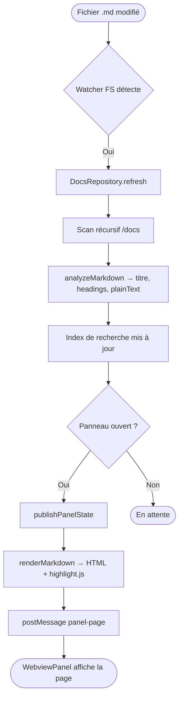
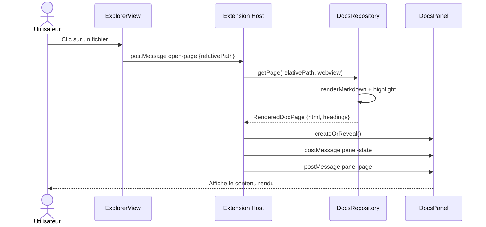
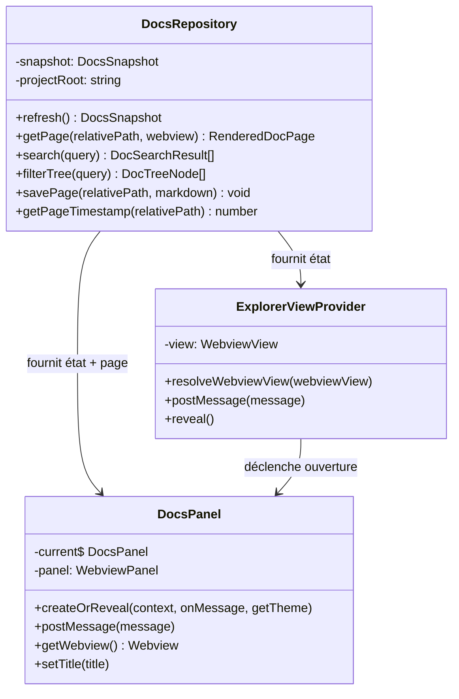
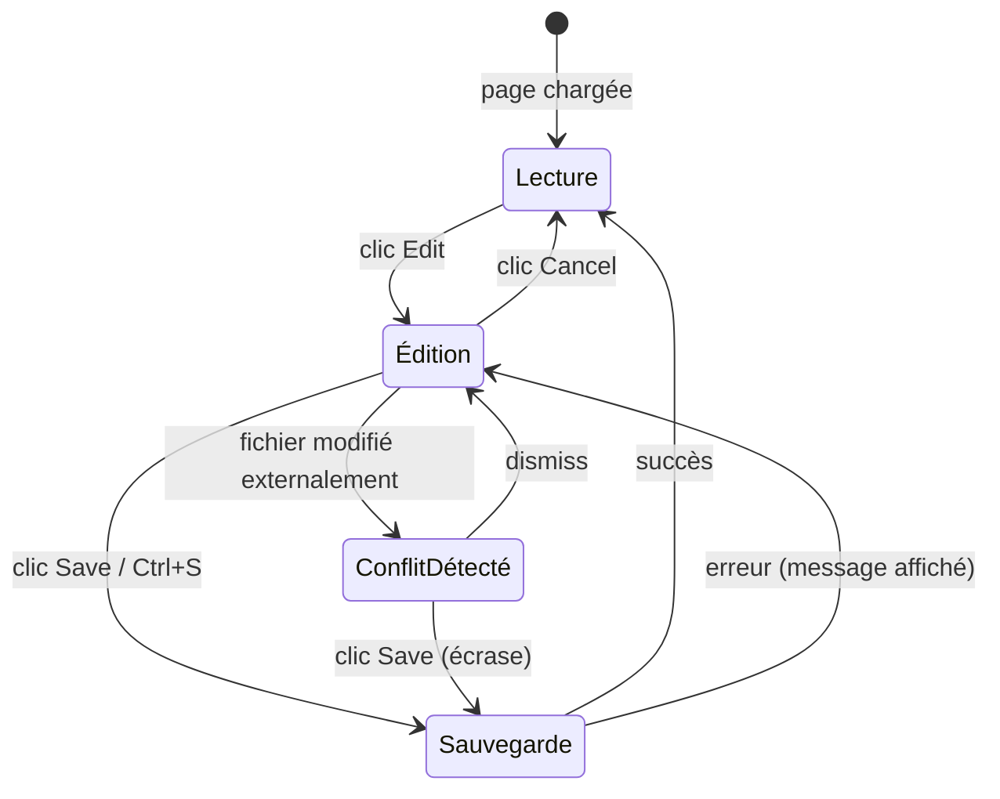
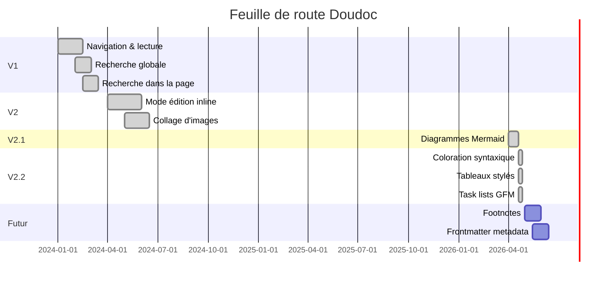
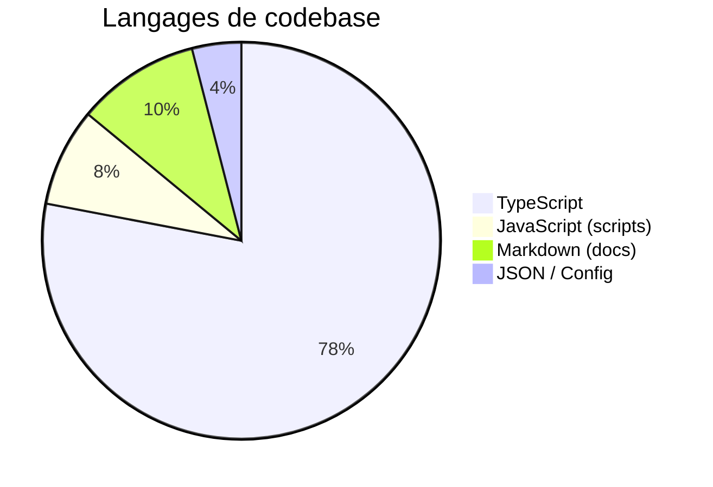
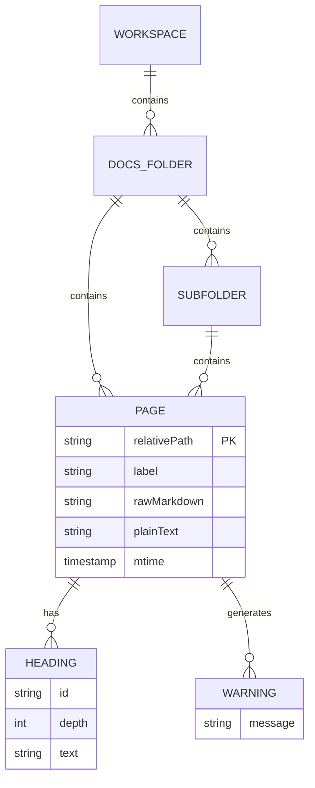

# Diagrammes Mermaid

Doudoc intègre **Mermaid v11** via un chargement asynchrone (sans bloquer l'affichage). Le thème du diagramme suit automatiquement le thème clair / sombre de l'interface.

---

## Flowchart — Processus de rendu

---

## Diagramme de séquence — Ouverture d'une page

---

## Diagramme de classes — Architecture principale

---

## Graphe d'état — Mode édition

---

## Diagramme Gantt — Feuille de route

---

## Diagramme en secteurs — Répartition des langages

---

## Diagramme entités-relations

---

## Navigation

- [← Tableaux](./tableaux.md)
- [Listes & tâches →](./listes-et-taches.md)
