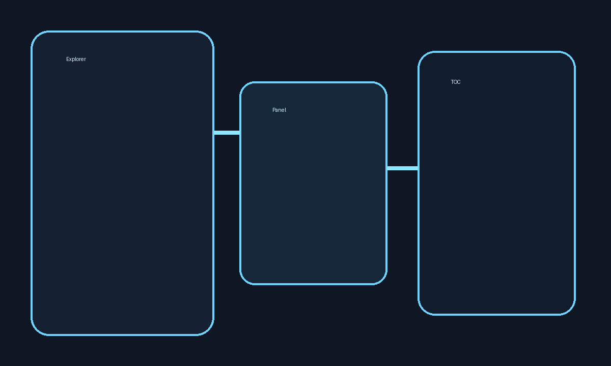

# Typographie & Formatage Markdown

Cette page démontre tous les éléments de formatage inline et de structure pris en charge par Doudoc.

---

## Titres

Les niveaux H1 à H6 sont rendus avec une hiérarchie visuelle distincte et génèrent automatiquement des entrées dans le **sommaire** (colonne de droite).

# H1 — Titre principal
## H2 — Section
### H3 — Sous-section
#### H4 — Détail
##### H5 — Note
###### H6 — Fin de hiérarchie

---

## Emphases et styles inline

Voici les combinaisons supportées :

- **Texte en gras** avec `**double astérisque**`
- *Texte en italique* avec `*astérisque*`
- ***Gras et italique*** avec `***triple***`
- ~~Texte barré~~ avec `~~double tilde~~`
- `code inline` avec des backticks
- **Combinaisons** : du `code` dans **du gras**, ou *de l'italique avec `code`*

---

## Paragraphes et sauts de ligne

Un paragraphe est un bloc de texte séparé par une ligne vide. Un seul retour chariot n'interrompt pas le paragraphe — c'est du Markdown standard.

Pour forcer un retour à la ligne dans un paragraphe,  
ajoutez deux espaces à la fin de la ligne précédente.

Lorem ipsum dolor sit amet, consectetur adipiscing elit. Sed do eiusmod tempor incididunt ut labore et dolore magna aliqua. Ut enim ad minim veniam, quis nostrud exercitation ullamco laboris.

---

## Citations (blockquotes)

> Une citation simple sur une ligne.

> Une citation plus longue qui s'étale sur plusieurs lignes. Elle est rendue avec un bord coloré et un fond subtil pour bien la distinguer du texte courant.

> **Blockquote avec mise en forme**
>
> On peut inclure du *gras*, de l'*italique*, du `code`, et même des listes :
>
> - premier élément
> - deuxième élément
>
> Et même des citations imbriquées :
>
>> Une citation dans une citation.

---

## Règle horizontale

Les règles horizontales `---` servent à séparer visuellement des sections.

Contenu avant la règle.

---

Contenu après la règle.

---

## Liens

- [Lien externe vers GitHub](https://github.com/Doulla1/Doudoc) — s'ouvre dans un nouvel onglet
- [Lien interne vers l'accueil](../index.md) — navigue dans le panneau Doudoc
- [Lien interne avec ancre](./tableaux.md#alignement-des-colonnes) — scroll vers la section
- [Lien vers une image locale](../assets/diagram.png)

---

## Images

Les images locales dans `/docs/assets/` sont résolues automatiquement par la webview.

Les images externes sont passées directement :

---

## Navigation

Voir aussi :
- [Blocs de code](./blocs-de-code.md) — coloration syntaxique & bouton Copy
- [Tableaux](./tableaux.md) — alignement, scroll horizontal
- [Diagrammes Mermaid](./diagrammes.md) — flowcharts, séquences, graphes
- [Listes & tâches](./listes-et-taches.md) — listes imbriquées, cases à cocher
